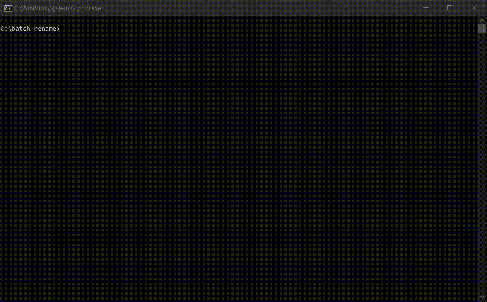

# pyBatchRenamer
#### Command Line Interface used to batch rename files within a folder to a new naming format while preserving original sequence number.

This CLI is created to ease the process of batch renaming multiple files in a folder that share a common naming format, while differing from each other by a certain sequence number. The program extracts this sequence number based on a mask provided by the user (or automatically inferred by the program) and proceeds to rename each file to the desired output format incorporating the same sequence number as the original.

For example, the following renaming can be done easily:
image01.img, image02.img, image03.img -> Hawaii - 1.img, Hawaii - 2.img, Hawaii - 3.img.


___
## How to use
1. Clone the repository
2. `pip install inquirer typer`
3. `python batch_rename.py PATH`, where `PATH` is the parent folder of the folder that contains the batch files that you want to rename.

This will initiate the CLI, which will take you through the following steps:
  1. Select the target folder.
  2. Optionally rename the target folder (Leave empty to skip this step).
  3. Input the extractor mask used to extract the seq num from the original names, with %s as placeholder for the sequence number.
  4. Input the output format you want the files to be renamed to, again with %s as placeholder for the sequence number.
  5. Inspect the changes and confirm if it is want you wanted. If not, type n and the program will undo all changes made to files and folder names.


#### Alternative for Windows users
A bat script has been included so that the CLI can be run from any directory by running `batch_rename.bat` or simply `batch_rename`. The script will then call the python program, automatically passing in the current working directory as the parent directory.

**Steps to setup the script:**
1. Edit `batch_rename.bat`, changing `"path/to/python.exe" "path/to/batch_rename.py" "%cd%"` to reflect the path to the Python interpreter as well as to the Python script on your machine.
2. Add the parent folder that contains `batch_rename.bat` to your environment `PATH` variable so that it can be called anywhere.


## Building using Setuptools
pyBatchRenamer now supports building into a CLI utility tool that can be run from anywhere without the use of a bat script.

How to setup:
1. Run `python setup.py develop`

Now, `renamer PATH` can be called from anywhere. Also supports relative paths, eg: `renamer .`, `renamer ..`, `renamer .\tests`, etc. 
Additionally, it now supports the --direct flag, which causes the program to treat the input `PATH` argument directly as the target folder, instead of the parent folder that we can select the target folder from, effectively allowing us to skip the first selection step.

Additional info is available by running `renamer --help` command.
```
>>> renamer --help
Usage: renamer [OPTIONS] PATH

  Batch rename files. If --direct is used, PATH will point directly to the
  folder containing the files to be renamed. Otherwise, PATH points at the
  parent directory whose folders can then be selected as the target folder.

Arguments:
  PATH  [required]

Options:
  --direct / --no-direct          Directly use path as target_dir instead of
                                  parent_dir.  [default: no-direct]
  --install-completion [bash|zsh|fish|powershell|pwsh]
                                  Install completion for the specified shell.
  --show-completion [bash|zsh|fish|powershell|pwsh]
                                  Show completion for the specified shell, to
                                  copy it or customize the installation.
  --help                          Show this message and exit.
```
